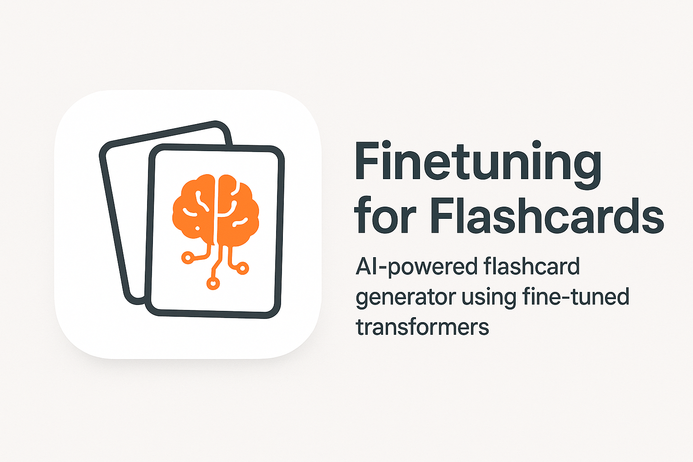
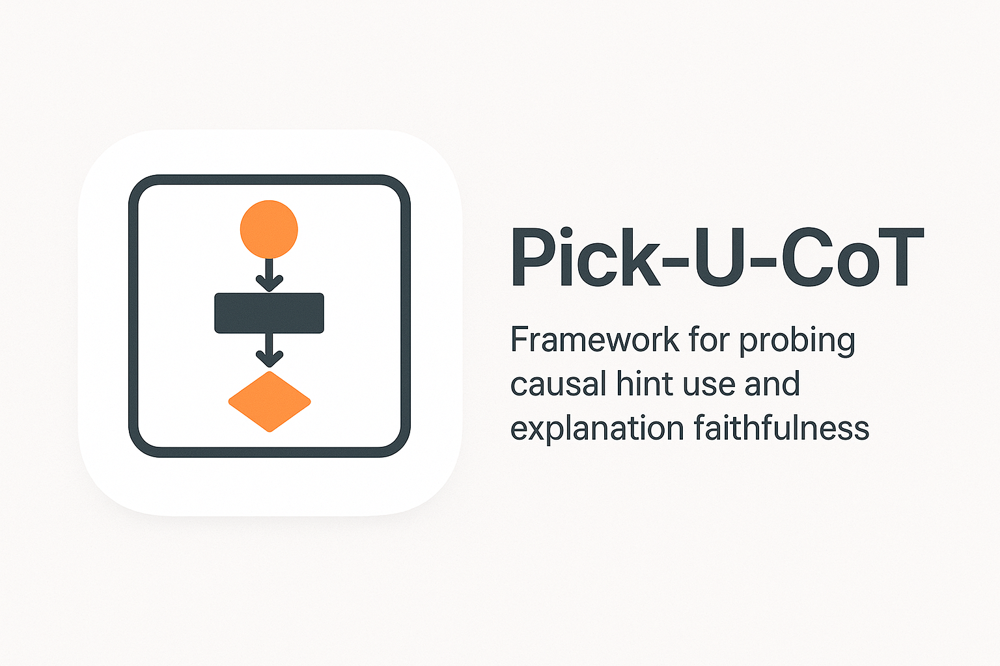
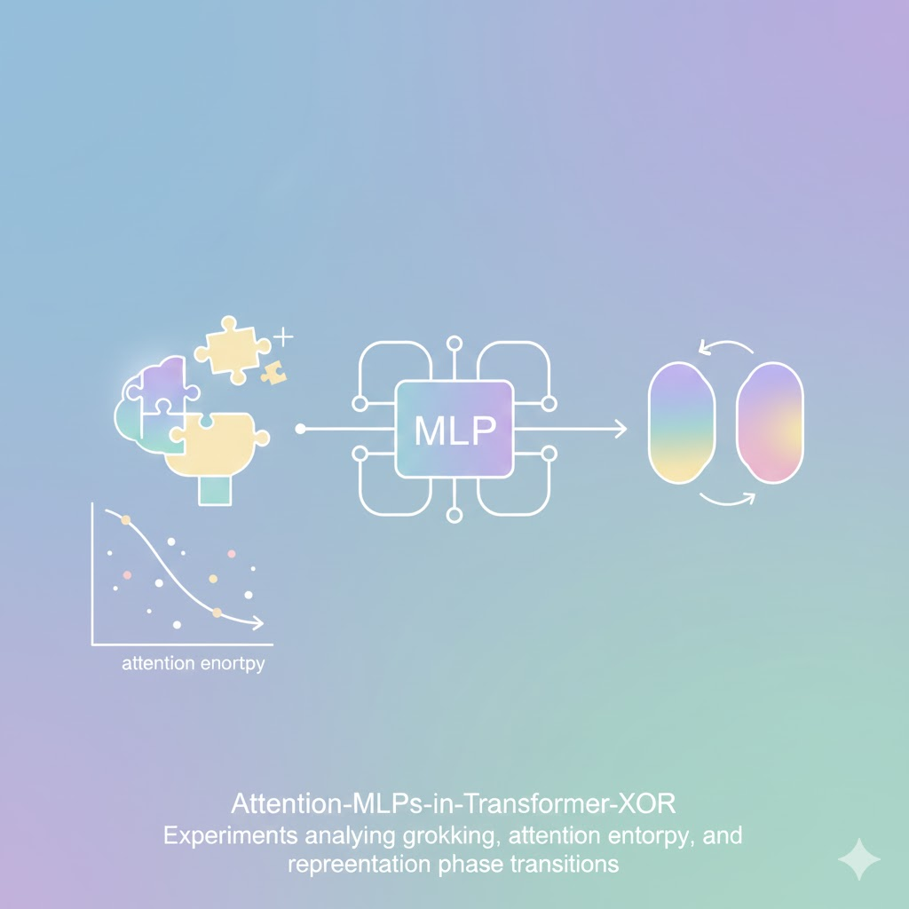

<!-- Avatar + Intro Section -->

  

  

    
<strong>Welcome! I am Vaaruni Desai.</strong>

    

      I am an AI researcher obsessed with how transformers think.
      I specialize in building probing tools to align AI to human goals.
    

    <a href="https://github.com/Vaaruni2797" 
     target="_blank"
     style="text-decoration: none;">
     🐈‍⬛ GitHub
    </a>
  
    <a href="https://www.linkedin.com/in/vaaruni-desai/" 
       target="_blank"
       style="text-decoration: none;">
       🔗 LinkedIn
    </a>
  
    <a href="mailto:vaaruni.desai@gmail.com"
       style="text-decoration: none;">
       📧 Email
    </a>
  
    <a href="https://medium.com/@vaaruni.desai" 
       target="_blank"
       style="text-decoration: none;">
       🖋️ Medium
    </a>
  

<!-- Project Cards Section -->

  

    
    <h3><a href="https://github.com/Vaaruni2797/FinetuningForFlashcards">Finetuning for Flashcards</a></h3>
    
AI-powered flashcard generator using fine-tuned transformers.

  

  

    
    <h3><a href="https://github.com/Vaaruni2797/pickucot">Pick-U-CoT</a></h3>
    
Framework for probing causal hint use and explanation faithfulness.

  

  

    
    <h3><a href="https://github.com/Vaaruni2797/Attention-MLPs-in-Transformer-XOR">The Role of Attention and MLPs in Transformer XOR Computation</a></h3>
    
Experiments analyzing grokking, attention entropy, and representation phase transitions.

  

